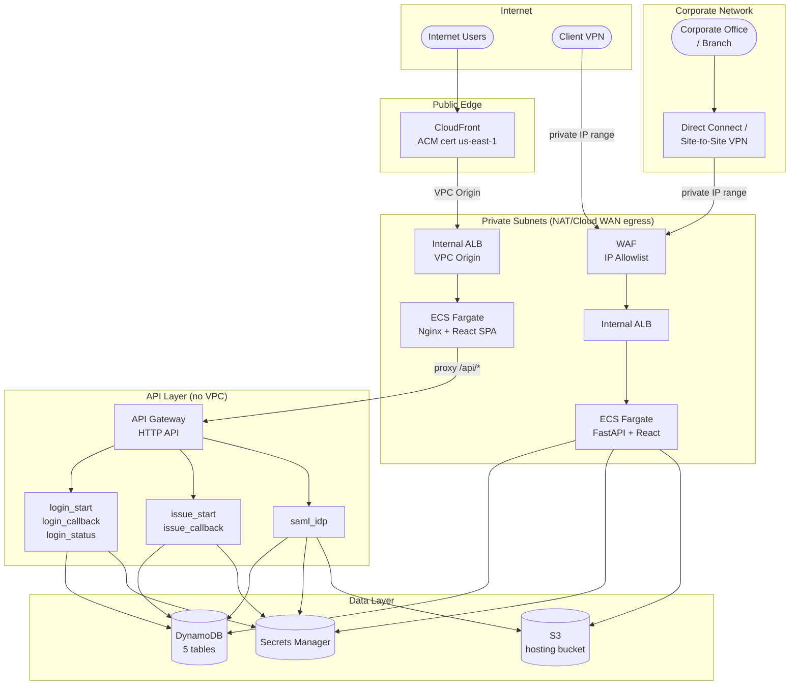
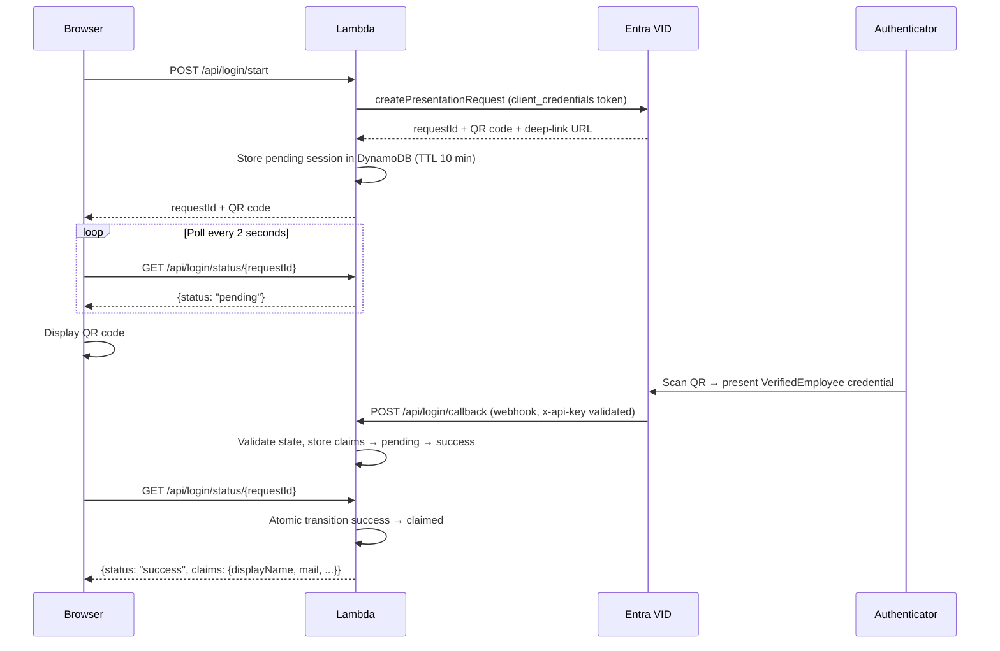
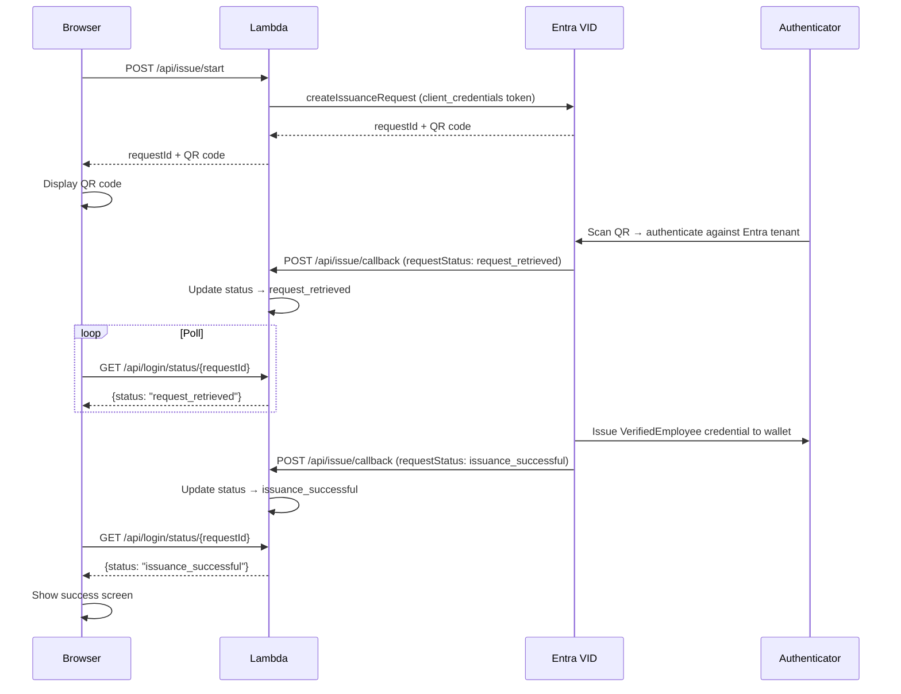
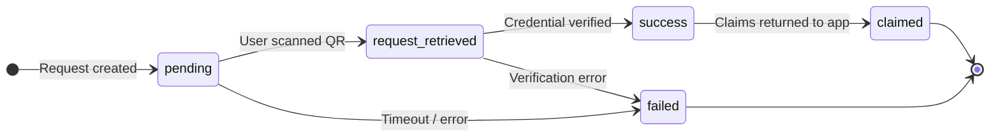
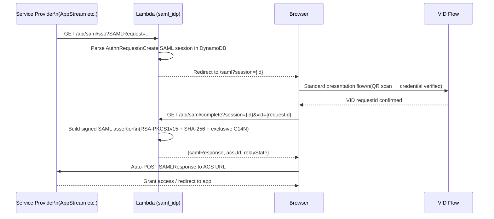

# Entra Verified ID

> **Disclaimer:** This project is not an official AWS product, service, or solution. It is an independent example implementation intended to demonstrate what is possible when combining AWS infrastructure with Microsoft Entra Verified ID. It is provided as a starting point to learn from, adapt, and iterate on — not as a supported or production-certified offering. Use it at your own discretion and always validate it against your organisation's security, compliance, and operational requirements before deploying to production.

A production-ready AWS deployment that enables **passwordless QR-code authentication** using Microsoft Entra Verified ID. Users authenticate by scanning a QR code with Microsoft Authenticator and presenting a VerifiedEmployee digital credential — no password, no OTP, no phishing risk.

---

## Contents

1. [What it does](#what-it-does)
2. [How Verified ID works](#how-verified-id-works)
3. [Architecture](#architecture)
4. [AWS services used](#aws-services-used)
5. [Prerequisites](#prerequisites)
6. [Deploying](#deploying)
7. [Configuration](#configuration)
8. [Authentication flows](#authentication-flows)
9. [SAML IdP](#saml-idp)
10. [Admin console](#admin-console)
11. [Signing keys](#signing-keys)
12. [Security model](#security-model)
13. [Development](#development)
14. [Troubleshooting](#troubleshooting)

---

## What it does

| Feature | Description |
|---|---|
| **Credential issuance** | A user visits `/issue`, scans a QR code, and receives a VerifiedEmployee credential in Microsoft Authenticator |
| **Standalone QR login** | Any application can call `/api/login/start` to challenge a user with a QR code and receive their verified claims |
| **SAML IdP** | Replaces Entra as the identity provider for SAML-federated apps (AppStream, WorkSpaces, etc.) — users scan a QR instead of entering a password |
| **Admin console** | A VPN-only internal web UI for managing SAML apps, signing keys, sessions, audit logs, and system configuration |

---

## How Verified ID works

Microsoft Entra Verified ID is a cloud service that issues and verifies cryptographically signed digital credentials. It abstracts W3C Verifiable Credentials and Decentralised Identifiers (DIDs) behind simple REST APIs.

### Core concepts

**Credential** — a signed JSON document stored in Microsoft Authenticator containing claims about the user (name, job title, department, email). Issued by your Entra tenant and cryptographically linked to the tenant's DID.

**DID (Decentralised Identifier)** — a globally unique identifier for your organisation's identity authority, e.g. `did:web:verifiedid.entra.microsoft.com:tenant-id:did-id`. Used to verify that credentials were issued by a trusted source.

**Presentation request** — your application asks the user to *prove* they hold a valid credential. The user scans a QR and presents the credential from their wallet. Your app receives the verified claims.

**Issuance request** — your application asks Entra to *issue* a new credential to a user. The user scans a QR and the credential is written to their Authenticator wallet.

### Microsoft-published constants (same in every tenant globally)

```
Verified ID service app ID:  3db474b9-6a0c-4840-96ac-1fceb342124f
OAuth scope:                 3db474b9-6a0c-4840-96ac-1fceb342124f/.default
Presentation API:            https://verifiedid.did.msidentity.com/v1.0/verifiableCredentials/createPresentationRequest
Issuance API:                https://verifiedid.did.msidentity.com/v1.0/verifiableCredentials/createIssuanceRequest
```

### Key request validation fields

| Field | Purpose |
|---|---|
| `authority` | Your organisation's DID |
| `acceptedIssuers` | List of trusted issuer DIDs — credentials from other issuers are rejected |
| `validateLinkedDomain: true` | Entra validates the DID is linked to your domain via `.well-known/did-configuration.json` |
| `allowRevoked: false` | Reject credentials that have been revoked by the issuer |

### VerifiedEmployee claims

The standard Entra `VerifiedEmployee` credential includes: `displayName`, `givenName`, `surname`, `mail`, `userPrincipalName`, `jobTitle`, `department`, `employeeId`.

---

## Architecture

### Infrastructure overview



### CDK stacks

All infrastructure is defined as AWS CDK TypeScript. Five stacks deploy in dependency order:

| Stack | Key Resources |
|---|---|
| `EntraVid-Data-{stage}` | 5 DynamoDB tables, 3 Secrets Manager secrets, S3 hosting bucket |
| `EntraVid-Layers-{stage}` | Lambda layer: cryptography + lxml + aws-lambda-powertools |
| `EntraVid-MainApp-{stage}` | 6 Lambda functions + API Gateway HTTP API |
| `EntraVid-PublicFrontend-{stage}` | ECS Fargate + internal ALB in private subnets, CloudFront distribution with VPC Origin |
| `EntraVid-Admin-{stage}` | ECS Fargate (private subnets), internal ALB, WAF |

> **No networking resources are created by CDK.** All VPCs, subnets, NAT gateways, and routing must be pre-existing. Operators supply VPC and subnet IDs as deploy-time context parameters.

### Lambda functions

| Function | Route(s) | Purpose |
|---|---|---|
| `login_start` | `POST /api/login/start` | Creates a VID presentation request; returns QR code + requestId |
| `login_callback` | `POST /api/login/callback` | Entra VID webhook — stores verified claims in DynamoDB |
| `login_status` | `GET /api/login/status/{requestId}` | Frontend polls this for the verification result |
| `issue_start` | `POST /api/issue/start` | Creates a VID issuance request; returns QR code + requestId |
| `issue_callback` | `POST /api/issue/callback` | Entra VID webhook — records issuance success or failure |
| `saml_idp` | `GET\|POST /api/saml/*` | SAML 2.0 IdP: metadata, SSO, initiate, complete, app list |

---

## AWS services used

The solution is built entirely on AWS-managed services — no self-managed infrastructure is required beyond a pre-existing VPC and subnets.

| Service | Resources created | Role in this solution |
|---|---|---|
| **Amazon DynamoDB** | 5 tables | The core data layer. **StateTable** tracks in-progress QR authentication requests with a 10-minute TTL. **SamlAppsTable** stores SAML SP configurations. **SystemConfigTable** holds all non-secret runtime config (tenant ID, DIDs, domains). **AdminUsersTable** stores admin console credentials. **AuditLogTable** provides a tamper-evident audit trail with 90-day TTL. All tables use pay-per-request billing and point-in-time recovery. |
| **AWS Secrets Manager** | 3 secrets | Stores all sensitive values outside the codebase. The **app secret** holds Entra client credentials, the webhook `callbackSecret`, and the RSA signing key PEM. The **bootstrap secret** is a one-time admin password auto-generated at deploy time and **permanently deleted** (`ForceDeleteWithoutRecovery`) immediately after the admin account is created during onboarding. The **JWT signing secret** is an HMAC key for admin session tokens. Lambda functions access secrets via the AWS Parameters and Secrets Lambda Extension and cache them for 5 minutes. |
| **AWS Lambda** | 6 functions + 1 layer | All business logic runs serverless. `login_start` and `issue_start` call the Microsoft Entra Verified ID REST API to create QR-based presentation and issuance requests. `login_callback` and `issue_callback` receive signed webhooks back from Entra. `login_status` is polled by the browser and atomically transitions state to *claimed* on first read. `saml_idp` implements a full SAML 2.0 IdP (metadata, SSO, assertion signing). A shared Lambda Layer bundles `cryptography`, `lxml`, and `aws-lambda-powertools`. |
| **Amazon API Gateway (HTTP API)** | 1 API, 6 route groups | The public REST endpoint for all Lambda functions. Routes map directly to each Lambda handler. Throttling limits are set to 100 req/s sustained and 200 burst. CORS is scoped to the public domain in production. An optional custom domain connects via ACM and Route 53. |
| **Amazon S3** | 2 buckets | Both buckets are fully private with public access blocked. The **hosting bucket** stores `.well-known/` DID and JWKS files, `config.json`, and the SAML signing certificate — written by the admin console, read by Lambdas via IAM. The **well-known bucket** (separate to avoid cross-stack circular dependencies) serves `/.well-known/*` via CloudFront using Origin Access Control (OAC) with SigV4 signing. |
| **Amazon ECS Fargate** | 2 clusters, 2 services | Runs the two long-lived stateful containers. The **public frontend** cluster serves the Nginx + React SPA (QR login, issue, and SAML screens). The **admin** cluster runs the FastAPI + React admin console. Both run on Fargate in private subnets with 2 desired tasks for availability; neither has a public IP. |
| **Application Load Balancer** | 2 internal ALBs | Both ALBs are internal (private subnets only). The **frontend ALB** is the origin target for CloudFront's VPC Origin — traffic never traverses the public internet. The **admin ALB** sits behind WAF and is only reachable from the VPN CIDR. Each ALB forwards to its Fargate target group on the container port. |
| **Amazon CloudFront** | 1 distribution, 1 OAC | The public edge for the frontend SPA. Connects to the internal frontend ALB via **VPC Origin** — no public ALB or internet gateway rule is needed. Path behaviours direct `/assets/*` and `/.well-known/*` to caching policies while `/api/*` and the SPA root bypass the cache. A CloudFront-managed Origin Access Control (OAC) enforces SigV4 request signing for the S3 well-known origin. |
| **AWS WAF** | 1 WebACL, 1 IP set | Protects the admin console. The WebACL default action is **BLOCK**; the single allow rule matches the operator-supplied VPN CIDR. The WebACL is associated with the admin ALB so all non-VPN traffic is dropped before reaching Fargate. |
| **AWS IAM** | 5 roles | Fine-grained least-privilege roles for every compute resource. The **Lambda execution role** grants `GetItem`/`PutItem`/`UpdateItem` on specific table ARNs and `GetSecretValue` on the app secret only. The **admin task role** has broader DynamoDB read/write, full secret access, and S3 write for the hosting buckets. Separate **task execution roles** handle ECR image pulls and CloudWatch Logs delivery. |
| **Amazon ECR** | 2 image repositories | CDK builds the admin and frontend Docker images locally during `cdk deploy` and pushes them to CDK-managed ECR repositories. Fargate pulls images from ECR at service launch. |
| **Amazon CloudWatch Logs** | 2 log groups | Container stdout/stderr for the admin and frontend Fargate services is streamed via the `awslogs` driver. Log groups have a 1-month retention policy. The admin console queries logs directly from the Audit Log page using CloudWatch Logs Insights. Lambda functions log to their default `/aws/lambda/*` log groups. |
| **AWS X-Ray** | (tracing) | Active tracing is enabled on all Lambda functions. Trace segments are automatically emitted for DynamoDB and Secrets Manager SDK calls, providing end-to-end visibility across the presentation and issuance flows without any code changes. |
| **AWS Certificate Manager (ACM)** | Referenced, not created | TLS certificates are created by the operator and passed to CDK as ARNs. A **CloudFront certificate** (must be in `us-east-1`) terminates HTTPS at the edge. An optional **regional certificate** covers API Gateway and the admin ALB when custom domains are configured. |
| **Amazon Route 53** | Up to 3 DNS records | When a hosted zone ID is provided, CDK creates an A alias record for the public domain (→ CloudFront), a CNAME for the API subdomain (→ API Gateway), and an A alias for the admin subdomain (→ admin ALB). Omitting the hosted zone ID skips record creation — useful when DNS is managed in a separate account. |
| **Amazon VPC / EC2** | 4 security groups | CDK does not create VPCs or subnets — operators supply existing IDs at deploy time. CDK creates security groups to wire the components together: CloudFront prefix list → frontend ALB → Fargate tasks, and VPN CIDR → admin ALB (then WAF-filtered) → admin Fargate tasks. Lambdas run outside the VPC and reach AWS services over IAM-authenticated endpoints. |

---

## Prerequisites

### Required tools

| Tool | Purpose | Notes |
|---|---|---|
| AWS CLI v2 | All AWS operations | Must be configured with credentials (see [Deploying](#deploying)) |
| Node.js 20+ | CDK execution | Install via [nodejs.org](https://nodejs.org) |
| npm 9+ | Package management | Bundled with Node.js |
| Docker | Build container images and Lambda layers | Required for full deployments. Not required for Lambda-only CDK updates. |
| `jq` | Used by `deploy.sh` | `apt install jq` / `brew install jq` |

### Required AWS resources (pre-existing)

| Resource | Requirement |
|---|---|
| VPC with internet gateway | The VPC must have an internet gateway attached — CloudFront VPC Origin requires it to reach the internal ALBs over the AWS backbone. Traffic never traverses the public internet; no resources need to be in public subnets. |
| Private subnets (≥ 2 AZs) | All ALBs and Fargate tasks run in private subnets with outbound internet access (NAT gateway or Cloud WAN) for ECR image pulls. Admin and frontend can share the same VPC and subnets; separate VPCs are supported via `adminVpcId`/`adminSubnetIds` overrides. |
| ACM certificate | A cert covering your public domain in `us-east-1` (required by CloudFront). Can be a wildcard (`*.example.com`) or a specific domain cert (`vid.example.com`) — either works. No regional cert needed; both ALBs are internal HTTP and TLS terminates at CloudFront. |

### Required Entra configuration

Complete the following steps in the **Azure Portal** before running `deploy.sh`. The values collected here are entered into the onboarding wizard after deployment.

---

#### Step 1 — Enable Verified ID

1. Sign in to [portal.azure.com](https://portal.azure.com) as a Global Administrator
2. Navigate to **Entra ID → Verified ID → Get started**
3. Follow the quick setup wizard — select **Microsoft-managed** for the DID (recommended)
4. After setup completes, go to **Verified ID → Overview** and note:
   - **Authority (DID)** — e.g. `did:web:verifiedid.entra.microsoft.com:260c418f...:3bc8e7d0...`
   - This is your DID authority — required in the wizard

---

#### Step 2 — Create the VerifiedEmployee credential type

If your tenant does not already have a VerifiedEmployee credential contract:

1. **Verified ID → Credentials → Add credential**
2. Select **VerifiedEmployee** from the template gallery
3. Configure display settings and claims mapping to your directory attributes
4. After creation, go to the credential and note the **Manifest URL** — e.g.:
   `https://verifiedid.did.msidentity.com/v1.0/tenants/{tenantId}/verifiableCredentials/contracts/{contractId}/manifest`

---

#### Step 3 — Create the IssuerVerifier app registration

This app registration is used by the Lambda functions to call the Verified ID REST API.

1. **Entra ID → App registrations → New registration**
   - Name: `VerifiedID-IssuerVerifier` (or your preferred name)
   - Supported account types: Accounts in this organisational directory only
   - No redirect URI required
2. After creation, note the **Application (client) ID** — this is your `clientId`
3. **Certificates & secrets → Client secrets → New client secret**
   - Set an expiry (12 or 24 months)
   - Copy the **Value** immediately — it is only shown once. This is your `clientSecret`
4. **API permissions → Add a permission → APIs my organisation uses**
   - Search for `Verifiable Credential`
   - Select **Verifiable Credentials Service Request**
   - Add application permission: `VerifiableCredential.Create.All`
5. **If you intend to restrict any SAML application to specific Entra groups** — also add a Microsoft Graph permission:
   - **API permissions → Add a permission → Microsoft Graph → Application permissions**
   - Search for and add: `GroupMember.Read.All`
   - This allows the Lambda to call the Graph API `checkMemberObjects` endpoint to verify group membership at login time
   - If you do not plan to use group-based access control on any SAML app, this permission is not required
6. **Grant admin consent** — click **Grant admin consent for {organisation}** and confirm all permissions

> `VerifiableCredential.Create.All` is always required. `GroupMember.Read.All` is only needed if you configure `allowedGroupIds` on one or more SAML applications — the Lambda will call the Microsoft Graph API to verify the authenticated user is in at least one of the permitted groups before issuing the SAML assertion.

---

#### Step 4 — Note your tenant ID

1. **Entra ID → Overview**
2. Copy the **Directory (tenant) ID** — a UUID in the format `xxxxxxxx-xxxx-xxxx-xxxx-xxxxxxxxxxxx`

---

#### Entra configuration summary

Collect these values before running the onboarding wizard:

| Value | Where to find it |
|---|---|
| Tenant ID | Entra ID → Overview → Directory (tenant) ID |
| IssuerVerifier Client ID | App registration → Overview → Application (client) ID |
| IssuerVerifier Client Secret | App registration → Certificates & secrets |
| DID Authority | Verified ID → Overview → Authority |
| Manifest URL | Verified ID → Credentials → your credential → Manifest URL |
| Accepted Issuer DID | Same as DID Authority (for same-tenant issuance) |

---

## Deploying

### Required IAM permissions

The AWS identity deploying the stacks needs the following permissions. The easiest approach is `AdministratorAccess` for the initial deploy, then scope down for updates.

For a scoped deploy policy, the minimum required service actions are:

```
cloudformation:*
ecr:*
ecs:*
lambda:*
iam:CreateRole, iam:AttachRolePolicy, iam:PutRolePolicy, iam:PassRole,
    iam:GetRole, iam:DeleteRole, iam:DetachRolePolicy
ec2:DescribeVpcs, ec2:DescribeSubnets, ec2:CreateSecurityGroup,
    ec2:AuthorizeSecurityGroupIngress, ec2:DescribeSecurityGroups
elasticloadbalancing:*
cloudfront:*
dynamodb:CreateTable, dynamodb:DescribeTable, dynamodb:DeleteTable,
    dynamodb:UpdateTable, dynamodb:TagResource
secretsmanager:CreateSecret, secretsmanager:GetSecretValue,
    secretsmanager:PutSecretValue, secretsmanager:UpdateSecret
s3:CreateBucket, s3:PutBucketPolicy, s3:PutObject, s3:GetObject
acm:RequestCertificate, acm:DescribeCertificate, acm:ListCertificates
route53:ChangeResourceRecordSets, route53:ListHostedZones
wafv2:CreateWebACL, wafv2:CreateIPSet, wafv2:AssociateWebACL
logs:CreateLogGroup, logs:PutRetentionPolicy
ssm:GetParameter (CDK bootstrap)
```

---

### Option 1 — Local machine with AWS SSO

Use this if your organisation uses AWS SSO (IAM Identity Center).

```bash
# Log in
aws sso login --profile <your-profile>

# Verify
aws sts get-caller-identity --profile <your-profile>

# Deploy
cd v2
./deploy.sh
# Select your SSO profile when prompted
```

---

### Option 2 — Local machine with IAM user credentials

Use this if you have a long-lived IAM user with access keys.

```bash
# Configure credentials
aws configure --profile deploy-user
# Enter: Access Key ID, Secret Access Key, region, output format

# Verify
aws sts get-caller-identity --profile deploy-user

# Set environment and deploy
export AWS_PROFILE=deploy-user
cd v2
./deploy.sh
```

Or use environment variables directly (useful in scripts):

```bash
export AWS_ACCESS_KEY_ID=AKIA...
export AWS_SECRET_ACCESS_KEY=...
export AWS_DEFAULT_REGION=ap-southeast-1

cd v2
./deploy.sh
```

---

### Option 3 — Local machine with IAM role assumption

Use this if you need to assume a deployment role (common in multi-account setups).

```bash
# Add to ~/.aws/config
[profile deploy-role]
role_arn = arn:aws:iam::123456789012:role/DeploymentRole
source_profile = default   # or another profile with sts:AssumeRole permission
region = ap-southeast-1

# Verify role assumption
aws sts get-caller-identity --profile deploy-role

# Deploy
export AWS_PROFILE=deploy-role
cd v2
./deploy.sh
```

---

### Option 4 — AWS CloudShell

> **Note:** CloudShell includes Docker. Full deployments that build container images (first deploy, admin console changes, frontend changes) work in CloudShell, but each session starts fresh with no Docker layer cache — builds will be slower than on a persistent machine.

CloudShell already has AWS CLI and Node.js. You only need to install CDK:

```bash
# In CloudShell — install Node.js 20 and CDK
curl -fsSL https://rpm.nodesource.com/setup_20.x | sudo bash -
sudo yum install -y nodejs
npm install -g aws-cdk

# Clone the repo
git clone https://github.com/your-org/entra-verified-id.git
cd entra-verified-id/v2
npm install

# For Lambda-only or config-only changes (no Docker required)
export CDK_DEFAULT_ACCOUNT=$(aws sts get-caller-identity --query Account --output text)
export CDK_DEFAULT_REGION=$AWS_DEFAULT_REGION

npx cdk deploy "EntraVid-MainApp-v2" --require-approval never
```

CloudShell credentials are automatically available — no configuration needed.

---

### Option 5 — EC2 instance (recommended for CI/CD or team pipelines)

An EC2 instance with an IAM instance profile is the cleanest approach for automated deployments.

```bash
# On an EC2 instance with appropriate instance profile
# Install prerequisites
sudo yum update -y
curl -fsSL https://rpm.nodesource.com/setup_20.x | sudo bash -
sudo yum install -y nodejs docker git jq
sudo systemctl start docker
sudo usermod -aG docker ec2-user
sudo npm install -g aws-cdk
newgrp docker

# Clone and deploy
git clone https://github.com/your-org/entra-verified-id.git
cd entra-verified-id/v2
npm install

export CDK_DEFAULT_ACCOUNT=$(aws sts get-caller-identity --query Account --output text)
export CDK_DEFAULT_REGION=ap-southeast-1

./deploy.sh --non-interactive   # uses .deploy.env for all parameters
```

---

### First-time deployment (any option)

Once authenticated, run:

```bash
cd v2
./deploy.sh
```

The script guides you through:

1. **Credential verification** — confirms your AWS identity before proceeding
2. **VPC selection** — queries your account and presents a numbered list of VPCs and subnets
3. **VPN CIDR** — the IP range allowed to reach the admin console
4. **Domain** — your public-facing domain (e.g. `vid.yourdomain.com`)
5. **ACM certificates** — select existing or create new DNS-validated certificates
6. **CDK bootstrap** — runs automatically if not already bootstrapped in the account/region
7. **Stack deployment** — all 5 stacks deployed in dependency order with progress output
8. **Post-deploy summary** — prints public URL, admin URL, and one-time bootstrap credentials

All parameters are saved to `.deploy.env` (gitignored) — subsequent runs use saved values as defaults.

### After the first deploy

Access the admin console from your VPN and complete the **onboarding wizard** (see [Admin Console](#admin-console)). The system is not functional until the wizard is completed — it collects your Entra tenant credentials, DID, domain settings, and generates signing keys.

### Re-deploying after changes

```bash
# Set account and region
export CDK_DEFAULT_ACCOUNT=<account-id>
export CDK_DEFAULT_REGION=ap-southeast-1
# Plus your credential method (profile / env vars / instance role)

# Lambda code changes only (fast, no Docker build needed)
npx cdk deploy "EntraVid-MainApp-v2" --require-approval never

# Admin console changes (requires Docker)
docker build -f admin/Dockerfile -t entra-vid-admin .
npx cdk deploy "EntraVid-Admin-v2" --require-approval never

# Public frontend changes (requires Docker)
docker build -f frontend/Dockerfile -t entra-vid-frontend .
npx cdk deploy "EntraVid-PublicFrontend-v2" --require-approval never

# All stacks
npx cdk deploy --all --require-approval never
```

---

## Configuration

### Architecture

Configuration is split across two AWS services — **never hardcoded**:

| Store | Contents |
|---|---|
| `EntraVerifiedIDSystemConfig-{stage}` DynamoDB | Non-secret: tenant ID, domain names, DID, URLs, SAML endpoints, signing key ID |
| `EntraVerifiedID/{stage}/app` Secrets Manager | Secrets: `clientId`, `clientSecret`, `callbackSecret`, `eamSigningKey`, `eamKid` |

Lambda functions load both at cold start and cache for 5 minutes. The admin console writes via the setup wizard and the System Configuration page.

### Configuration keys reference

All keys are written automatically by the onboarding wizard:

| Key | Store | Description |
|---|---|---|
| `tenant_id` | Config | Entra tenant directory ID |
| `issuer_verifier_client_id` | Config | App registration client ID for credential operations |
| `authority` / `did_authority` | Config | Your organisation's DID |
| `manifest_url` | Config | VerifiedEmployee credential contract manifest URL |
| `accepted_issuer` | Config | Trusted issuer DID for presentation validation |
| `public_domain` | Config | User-facing domain |
| `api_domain` | Config | API Gateway domain for webhook callbacks |
| `frontend_base_url` | Config | Full frontend URL including protocol |
| `callback_base_url` | Config | Base URL for Entra VID webhook callbacks |
| `client_name` | Config | Organisation name shown in QR screens |
| `entity_id` | Config | SAML IdP entity ID |
| `saml_sso_url` | Config | SAML SSO endpoint URL |
| `kid` | Config | Active signing key ID |
| `clientId` | Secret | IssuerVerifier app client ID |
| `clientSecret` | Secret | IssuerVerifier app client secret |
| `callbackSecret` | Secret | Webhook API key — auto-generated 32-byte random value |
| `eamSigningKey` | Secret | RSA-2048 private key PEM |
| `eamKid` | Secret | Signing key ID |

---

## Authentication flows

### Presentation flow (QR login / SAML authentication)



### Issuance flow (credential enrolment)



### Session state machine



---

## SAML IdP

### Flow



For landing-page initiated flows (no SP redirect), the browser calls `/api/saml/initiate?app={appId}` to create the session without an `AuthnRequest`.

### Adding a SAML application

**Step 1 — Create the IAM SAML provider** (one per deployment, shared across all apps)

1. Admin console → SAML Applications → **Download IdP Metadata**
2. AWS IAM Console → Identity providers → Add provider → SAML → upload the XML
3. Note the provider ARN: `arn:aws:iam::{account}:saml-provider/{name}`

**Step 2 — Create an IAM role with the following trust policy:**

```json
{
  "Effect": "Allow",
  "Principal": {
    "Federated": "arn:aws:iam::{account}:saml-provider/{name}"
  },
  "Action": "sts:AssumeRoleWithSAML",
  "Condition": {
    "StringEquals": {
      "SAML:aud": "https://signin.aws.amazon.com/saml"
    }
  }
}
```

**Step 3 — Add the app in the admin console**

Admin console → SAML Applications → Add App. The app tile appears on the public landing page immediately.

> **After key rotation:** Re-download IdP metadata and re-upload to your IAM SAML provider. The old certificate will no longer be valid for signature verification.

### Group-based access control

Each SAML application can optionally be restricted to one or more Entra security groups. When `allowedGroupIds` is configured on an app, the Lambda calls the Microsoft Graph API after the user's Verified ID credential is verified — before the SAML assertion is issued. If the user is not a member of at least one of the permitted groups, the authentication is denied.

**How it works:**

1. The user completes the QR scan and their VerifiedEmployee credential is verified
2. The Lambda retrieves the `allowedGroupIds` configured for the SAML app
3. If the list is non-empty, a Graph API call is made to `POST /v1.0/users/{email}/checkMemberObjects` with the list of group IDs
4. If the user is not in any of the allowed groups, a `403` is returned and no SAML assertion is produced
5. If the list is empty, all verified users are permitted (no group restriction)

The check **fails closed** — if the Graph API call fails for any reason (network error, invalid credentials), access is denied rather than granted.

**Configuring group access on a SAML app:**

1. In the Azure Portal, find the group(s) you want to allow: **Entra ID → Groups → {group} → Overview** — copy the **Object ID** (a UUID)
2. In the admin console, open the SAML app and add the group Object IDs to the **Allowed Group IDs** field (one per line)
3. Ensure the IssuerVerifier app registration has `GroupMember.Read.All` with admin consent granted (see [Step 3 of Entra configuration](#step-3--create-the-issuerverifier-app-registration))

> The same `clientId` and `clientSecret` from the IssuerVerifier app registration are used for both Verified ID API calls and Graph API group checks — no additional app registration is required.

---

## Admin Console

Accessible from VPN only (WAF blocks all other traffic). URL is printed by `deploy.sh` after deployment.

### Onboarding wizard

Run once on first access. Six steps collect all required configuration. Progress is saved between steps. The wizard locks permanently after completion — use System Config for post-setup edits.

### Pages

| Page | Purpose |
|---|---|
| **Dashboard** | System status, SAML app count, active sessions, signing key age, recent audit events |
| **SAML Applications** | Add/edit/disable apps; download IdP metadata; copy metadata URL |
| **Sessions** | Active in-flight VID sessions (users mid-authentication); revoke stuck sessions |
| **Signing Keys** | Current key ID, JWKS URL, key rotation (grace window keeps old key valid) |
| **System Config** | All configuration grouped by category; inline editing for editable keys |
| **Audit Log** | Admin action trail + container runtime logs (health checks filtered) |

---

## Signing Keys

### What is signed

Every SAML assertion is signed with an RSA-2048 private key. The corresponding public certificate is published in the JWKS and in the IdP metadata that SPs use to verify signatures.

### Key storage

| Item | Location |
|---|---|
| Private key PEM | Secrets Manager → `eamSigningKey` |
| Public JWKS | S3 hosting bucket → `.well-known/jwks.json` |
| OIDC discovery | S3 hosting bucket → `.well-known/openid-configuration` |
| Key ID (kid) | SystemConfig DynamoDB → `kid` |

### Rotation

Admin console → Signing Keys → **Rotate Keys**.

A new RSA-2048 keypair is generated. The JWKS is updated with **both old and new keys** during a grace window so existing sessions remain valid. After rotation, download fresh IdP metadata from the admin console and re-upload to your AWS IAM SAML provider.

---

## Security model

### Webhook authentication

All Entra VID callbacks include an `x-api-key` header. The `callbackSecret` is validated using **constant-time comparison** to prevent timing attacks. Auto-generated during setup (32 bytes, URL-safe base64).

### Admin console authentication

The admin console uses a self-managed authentication stack rather than a third-party identity provider. Every layer is hardened independently so that no single weakness grants access.

#### Account creation and bootstrap

A random one-time bootstrap password is generated automatically during CDK deployment and stored in AWS Secrets Manager (`EntraVerifiedID/{stage}/bootstrap-admin`). This password is never shown in the CDK output or logs — it must be retrieved directly from Secrets Manager by an operator with IAM access.

During the onboarding wizard, the operator supplies this bootstrap token via the `X-Bootstrap-Token` request header to create the first (and only) admin account. **Immediately after the admin user is created, the bootstrap secret is permanently deleted from Secrets Manager** (`ForceDeleteWithoutRecovery=True`) — it cannot be recovered or reused. The setup endpoint is then locked permanently and cannot be called again.

This means:
- The bootstrap credential has a lifetime of minutes, not days
- Even if it were intercepted, it is useless once setup completes
- There is no secondary path to create admin accounts

#### Password storage

Passwords are hashed with **Argon2id** — the algorithm recommended by OWASP and the winner of the Password Hashing Competition. The parameters used are:

| Parameter | Value | Effect |
|---|---|---|
| `time_cost` | 2 iterations | Controls CPU work per hash |
| `memory_cost` | 65,536 KiB (64 MB) | Makes GPU/ASIC attacks impractical — each attempt requires 64 MB of RAM |
| `parallelism` | 2 threads | Matches typical server core count |

Each hash includes a **unique random salt** generated automatically by the library, so identical passwords produce different hash values — pre-computed rainbow table attacks do not work.

The plain-text password is never written to logs, DynamoDB streams, or CloudWatch. Only the hash is persisted.

#### Session management

After a successful login, the server issues a signed **JWT** stored in an `HttpOnly` cookie (`vid_admin_session`):

| Property | Value |
|---|---|
| Algorithm | HS256 — signed with a 64-byte random key stored in Secrets Manager |
| Expiry | 8 hours |
| Claims required | `sub`, `exp`, `iat`, unique `jti` |
| Cookie flags | `HttpOnly`, `SameSite=Lax`; `Secure=True` when HTTPS is configured |

On every authenticated request the server validates the JWT signature and expiry, then makes a **live DynamoDB lookup** to check that the account has not been disabled or locked since the token was issued. A valid JWT alone is not sufficient — the account must still be active at request time.

#### Brute force protection

Failed login attempts are tracked per username in DynamoDB:

- After **5 consecutive failures** the account is locked for **15 minutes**
- The lock timestamp is stored server-side — it cannot be bypassed by clearing cookies or changing IP addresses
- On a successful login, the failed attempt counter and lock are cleared atomically

#### TOTP MFA

Multi-factor authentication is enforced after the first password change. The admin cannot access any protected page until a TOTP authenticator app (e.g. Microsoft Authenticator, Google Authenticator) is enrolled. MFA state is stored in the AdminUsers DynamoDB table and checked on every login.

#### Network isolation

The admin console has no public endpoint:

- The admin ALB is **internal** (private subnets only) — it has no internet-facing listener
- A **WAF WebACL** is associated with the ALB; the default action is `BLOCK` and only the operator-supplied VPN CIDR is allowed
- An attacker cannot reach the login page without first being on the corporate VPN or Direct Connect network

### Lambda IAM (least privilege)

Lambdas share a single IAM role scoped to:
- DynamoDB: `GetItem`, `PutItem`, `UpdateItem`, `Query` on specific table ARNs
- Secrets Manager: `GetSecretValue` on the app secret ARN only
- S3: `GetObject` on the hosting bucket (for SAML signing certificate)

### SAML XML signing

- **Algorithm:** RSA-PKCS1v15 + SHA-256
- **Canonicalisation:** Exclusive C14N via `lxml`
- **ACS URL:** always read from DynamoDB — never taken from the incoming `AuthnRequest`

---

## Development

### Local setup

```bash
npm install                     # Install CDK and workspace dependencies

# Admin backend
cd admin
pip install -e ".[dev]"
uvicorn app.main:app --reload --port 8000

# Admin SPA (runs on http://localhost:3001)
cd admin/web && npm run dev

# Public frontend (runs on http://localhost:5173)
cd frontend && npm run dev
```

### Validate CDK without deploying

```bash
export CDK_DEFAULT_ACCOUNT=<account-id>
export CDK_DEFAULT_REGION=<region>
npx cdk synth --quiet
```

### TypeScript check

```bash
npx tsc --noEmit
```

### Lambda shared helpers

- `lambdas/shared/config.py` — reads SystemConfig from DynamoDB with 5-minute in-memory cache
- `lambdas/shared/secrets.py` — reads Secrets Manager with 5-minute cache; tries the Parameters and Secrets Lambda Extension first, falls back to direct boto3

---

## Troubleshooting

### "Could not start sign-in" on SAML flow
- Verify `/api/saml/initiate` is registered as an API Gateway route in `main-app-stack.ts`
- Confirm the Lambda IAM role has `s3:GetObject` on the hosting bucket (needed to read the signing certificate from S3)

### SAML signature verification fails at the SP
- Key rotation changed the signing certificate. Re-download IdP metadata from the admin console and re-upload to your AWS IAM SAML provider.

### Admin console login signs out immediately
- `SECURE_COOKIE=true` but the admin ALB is HTTP-only. Ensure `SECURE_COOKIE=false` is set in the ECS container environment (controlled by `hasCustomDomain` in `admin-stack.ts`).

### "System configuration not initialised" from Lambdas
- The onboarding wizard has not been completed. Open the admin console and run through all steps.
- Verify `onboarding_complete = true` exists in the `EntraVerifiedIDSystemConfig-{stage}` DynamoDB table.

### SAML metadata download returns 503
- The signing key wizard step was not completed — no JWKS file exists in S3.
- Confirm the Lambda has `s3:GetObject` permission on `.well-known/jwks.json` in the hosting bucket.

### API calls return 403 from CloudFront
- Nginx is forwarding `Host: {your-domain}` to API Gateway (which doesn't recognise that hostname).
- The Nginx proxy config must use `proxy_set_header Host $proxy_host;` not `$http_host`.

### Admin audit log page returns 500
- The admin ECS task role is missing `dynamodb:Query`. Confirm `tables.auditLog.grantReadWriteData(taskRole)` is present in `admin-stack.ts`.

---

## Project structure

```
v2/
├── bin/app.ts                    CDK entry — context-driven, zero hardcoded values
├── lib/
│   ├── data-stack.ts             DynamoDB, Secrets Manager, S3
│   ├── layers-stack.ts           Lambda layer (Docker build)
│   ├── main-app-stack.ts         Lambda functions + API Gateway routes
│   ├── public-frontend-stack.ts  ECS Fargate + internal ALB + CloudFront VPC Origin
│   └── admin-stack.ts            Admin ECS Fargate + internal ALB + WAF
├── lambdas/
│   ├── shared/                   config.py + secrets.py (TTL-cached)
│   ├── login_start/              Presentation request creation
│   ├── login_callback/           Presentation webhook receiver
│   ├── login_status/             Status polling endpoint
│   ├── issue_start/              Issuance request creation
│   ├── issue_callback/           Issuance webhook receiver
│   └── saml_idp/                 SAML 2.0 IdP
├── frontend/
│   ├── src/pages/                Landing, Login, Issue, Saml
│   └── nginx.conf                API proxy + health endpoint
├── admin/
│   ├── app/routes/               auth, setup, saml_apps, sessions, keys, config, audit
│   ├── app/services/             key_service, setup_service
│   └── web/src/pages/            Dashboard, SamlApps, Sessions, Keys, Config, Audit
├── layer/Dockerfile              Lambda layer build
├── shared-ui/src/                Shared MUI theme + components
└── deploy.sh                     Interactive deployment script
```
